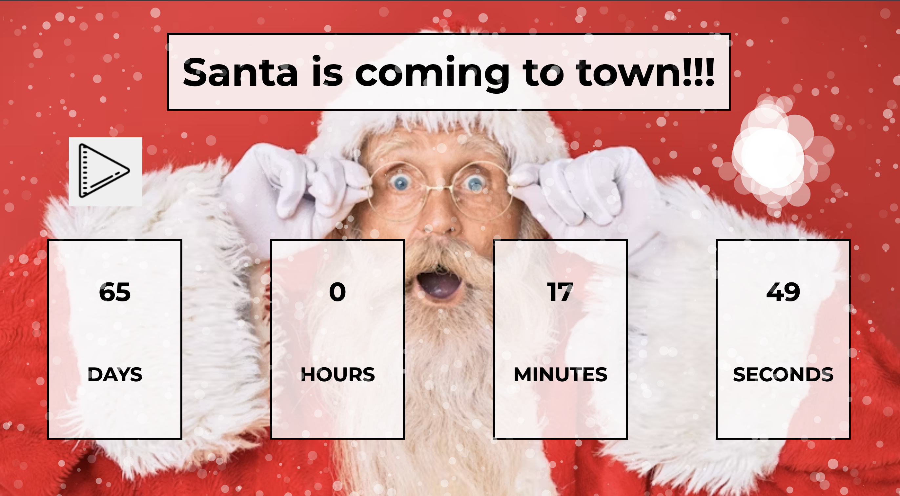

# 🎅 Christmas Countdown

> A festive and fun countdown app that tells you exactly how long until Santa comes to town! 🎄✨  
> [👉 View Live Project](https://christmas-countdown-nataliia-litskevy.netlify.app/)

---

## 🖼️ Preview



---

## 🚀 Features

- 🎅 Real-time countdown to **Christmas Day (December 25)**
- 🕒 Displays **days, hours, minutes, and seconds** remaining
- ❄️ Animated falling snow effect using a JavaScript snow library
- 🎨 Festive design with bright holiday colors
- 🌈 Fully responsive layout for all screen sizes

---

## 🛠️ Technologies Used

- **HTML5** — page structure  
- **CSS3** — styling and layout  
- **JavaScript (ES6)** — countdown logic and DOM updates  
- **Snow.js library** — for animated snowflakes  

---

## 📂 Project Structure

```
📁 christmas-countdown/
├── index.html
├── style.css
├── script.js
├── assets/
│   └── screenshot.png
└── README.md
```

---

## ⚙️ How It Works

1. The JavaScript file calculates the time difference between the current date and **December 25**.  
2. It updates the countdown every second using `setInterval()`.  
3. A snow animation runs in the background for a cozy holiday feeling.  
4. When the countdown reaches zero — Christmas has arrived! 🎉  

---

## 💡 How to Run Locally

1. Clone this repository:
   ```bash
   git clone https://github.com/NataliiaLitskevych/Christmas-countdown.git
   ```
2. Open the project folder:
   ```bash
   cd christmas-countdown
   ```
3. Open `index.html` in your browser and enjoy the holiday countdown! 🎅

---

## 🧠 Future Enhancements

- 🎵 Add background Christmas music  
- 🌟 Add animation of Santa flying across the sky  
- 🎁 Display a festive message when countdown hits zero  
- 📱 Add a dark/light mode toggle  

---

## 👩‍💻 Author

**Nataliia Litskevych**  
🎄 Frontend Developer | HTML • CSS • JavaScript  
🌐 [Live Project](https://christmas-countdown-nataliia-litskevy.netlify.app/)  

---

⭐ *Feel the magic of the holidays every second with this cheerful Christmas Countdown!* ⭐
